# Dizimus

> Sistema de gestão de igrejas


---

## Stack

| Camada | Tecnologias |
|--------|------------|
| **Backend** | Django · Django Ninja · Pydantic · Celery |
| **Banco de Dados** | PostgreSQL |
| **Cache / Fila** | Redis |
| **Armazenamento** | MinIO (S3 Compatible) |
| **Infraestrutura** | Docker · Docker Compose · Nginx · Gunicorn · Whitenoise |

---

## Arquitetura do Projeto

### Visão Geral

```mermaid
graph TD
    ROOT["📦 dizimus/"]

    ROOT --> CONF["⚙️ config/"]
    ROOT --> APPS["🧩 apps/"]
    ROOT --> INFRA["🐳 docker/"]
    ROOT --> REQ["📋 requirements/"]
    ROOT --> SHARED["📁 Diretórios Compartilhados"]
    ROOT --> FILES["📄 Arquivos Raiz"]

    %% CONFIG
    CONF --> CONF_SETS["settings/"]
    CONF --> CONF_FILES["urls.py · api.py · asgi.py · wsgi.py"]
    CONF_SETS --> SETS_FILES["base.py · dev.py · prod.py · test.py"]

    %% APPS
    APPS --> APP_CORE["core/"]
    APPS --> APP_CHURCH["churches/"]
    APPS --> APP_USERS["users/"]
    APPS --> APP_MEM["members/"]
    APPS --> APP_CONTRIB["contributions/"]
    APPS --> APP_PAY["payments/"]
    APPS --> APP_REC["receipts/"]
    APPS --> APP_REP["reports/"]
    APPS --> APP_DASH["dashboards/"]
    APPS --> APP_HOOK["webhooks/"]
    APPS --> APP_INTEG["integrations/"]
    APP_INTEG --> APP_ASAAS["asaas/"]

    %% DOCKER
    INFRA --> INF_DJ["django/\n└ entrypoint.sh"]
    INFRA --> INF_NG["nginx/\n└ default.conf"]
    INFRA --> INF_PG["postgres/"]
    INFRA --> INF_RD["redis/"]

    %% REQUIREMENTS
    REQ --> REQ_FILES["base.txt · dev.txt · prod.txt"]

    %% SHARED
    SHARED --> SH_TPL["templates/"]
    SHARED --> SH_STT["static/"]
    SHARED --> SH_MED["media/"]
    SHARED --> SH_LOG["logs/"]
    SHARED --> SH_SCR["scripts/"]
    SHARED --> SH_MIO["minio/"]

    %% ROOT FILES
    FILES --> RF1["manage.py"]
    FILES --> RF2["Dockerfile"]
    FILES --> RF3["docker-compose.dev.yml"]
    FILES --> RF4["docker-compose.prod.yml"]
    FILES --> RF5[".env · .env.example"]

    %% Styles
    style ROOT fill:#4f46e5,color:#fff,stroke:#3730a3
    style CONF fill:#0ea5e9,color:#fff,stroke:#0284c7
    style APPS fill:#10b981,color:#fff,stroke:#059669
    style INFRA fill:#f59e0b,color:#fff,stroke:#d97706
    style REQ fill:#8b5cf6,color:#fff,stroke:#7c3aed
    style SHARED fill:#6b7280,color:#fff,stroke:#4b5563
    style FILES fill:#6b7280,color:#fff,stroke:#4b5563
    style APP_INTEG fill:#d1fae5,color:#065f46,stroke:#6ee7b7
```



---

### Estrutura Interna dos Apps

Cada app segue uma arquitetura baseada em separação de responsabilidades:

```mermaid
graph TD
    APP["📁 apps/members/"]

    APP --> DATA["🗄️ Dados"]
    APP --> API_L["🌐 API"]
    APP --> BIZ["⚙️ Negócio"]
    APP --> INFRA2["🔧 Infraestrutura"]
    APP --> TEST["🧪 tests/"]

    DATA --> models["models.py\nModelos do banco"]
    DATA --> repos["repositories.py\nPersistência e acesso ao banco"]
    DATA --> selectors["selectors.py\nQueries e leitura de dados"]
    DATA --> migrations["migrations/"]

    API_L --> api["api.py\nEndpoints da API"]
    API_L --> schemas["schemas.py\nSchemas Pydantic"]
    API_L --> filters["filters.py\nFiltros de consulta"]
    API_L --> perms["permissions.py\nControle de permissões"]

    BIZ --> services["services.py\nRegras de negócio"]
    BIZ --> tasks["tasks.py\nTarefas Celery"]
    BIZ --> signals["signals.py\nEventos Django"]

    INFRA2 --> constants["constants.py\nConstantes do domínio"]
    INFRA2 --> exceptions["exceptions.py\nExceções customizadas"]
    INFRA2 --> apps_py["apps.py"]

    style APP fill:#4f46e5,color:#fff,stroke:#3730a3
    style DATA fill:#0ea5e9,color:#fff,stroke:#0284c7
    style API_L fill:#10b981,color:#fff,stroke:#059669
    style BIZ fill:#f59e0b,color:#fff,stroke:#d97706
    style INFRA2 fill:#8b5cf6,color:#fff,stroke:#7c3aed
    style TEST fill:#6b7280,color:#fff,stroke:#4b5563
```



---

## Responsabilidade dos Arquivos

| Arquivo | Camada | Responsabilidade |
|---------|--------|-----------------|
| `models.py` | Dados | Modelos do banco de dados |
| `repositories.py` | Dados | Persistência e acesso ao banco |
| `selectors.py` | Dados | Queries e leitura de dados |
| `schemas.py` | API | Schemas do Django Ninja / Pydantic |
| `api.py` | API | Endpoints da API |
| `filters.py` | API | Filtros de consulta |
| `permissions.py` | API | Controle de permissões |
| `services.py` | Negócio | Regras de negócio |
| `tasks.py` | Negócio | Tarefas assíncronas do Celery |
| `signals.py` | Negócio | Eventos do Django |
| `constants.py` | Infra | Constantes do domínio |
| `exceptions.py` | Infra | Exceções customizadas |

---

## Ambientes

### Desenvolvimento

```bash
cp .env.example .env
docker compose -f docker-compose.dev.yml up --build
```

### Produção

```bash
docker compose -f docker-compose.prod.yml up --build -d
```

---

## Comandos Úteis

```bash
# Migrações
docker compose exec web python manage.py migrate

# Superusuário
docker compose exec web python manage.py createsuperuser

# Celery worker
celery -A config worker -l info
```

---

## MinIO

| Interface | URL |
|-----------|-----|
| Painel Administrativo | `http://localhost:9001` |
| Endpoint S3 | `http://localhost:9000` |

---

## Objetivos da Arquitetura

- **Alta escalabilidade** — estrutura modular preparada para crescimento
- **Separação de responsabilidades** — cada arquivo tem um papel claro
- **Fácil manutenção** — organização previsível em todos os apps
- **Preparação para microsserviços** — apps independentes e desacoplados
- **Infraestrutura pronta para produção** — Docker, Nginx, Gunicorn e Whitenoise configurados